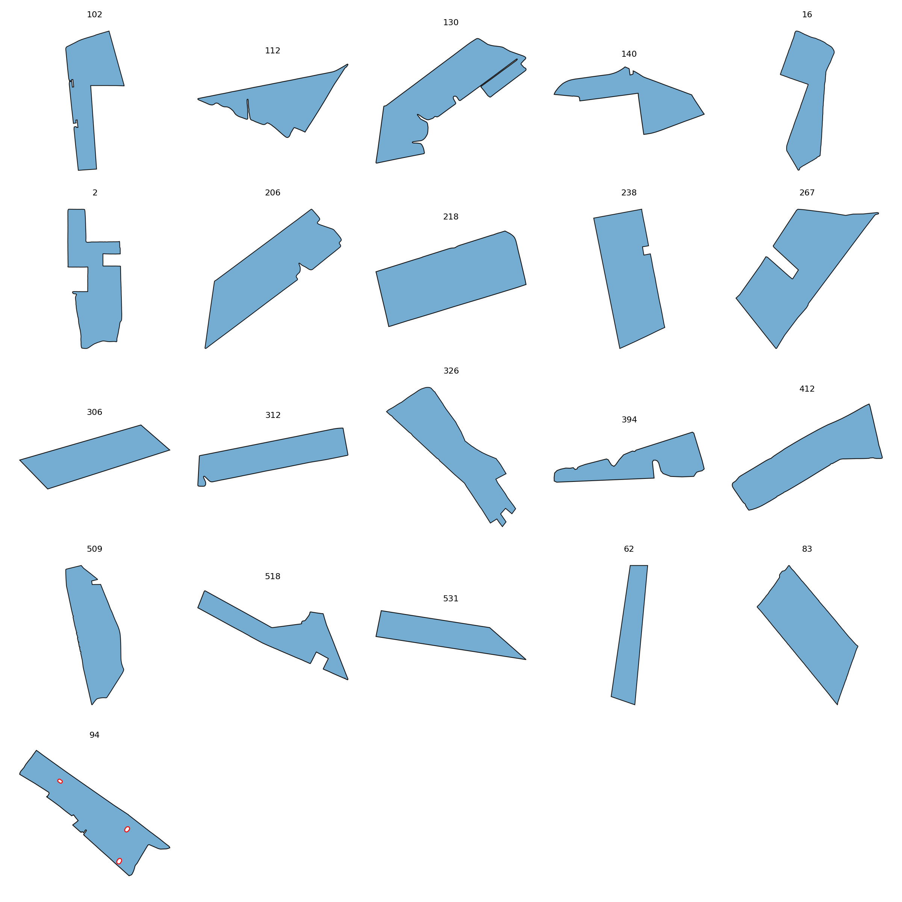

# ClassElongated

This folder contains **21 fields** assigned to the **ClassElongated** class.

## Gallery

## Statistics

| Metric | Value |
|----------|----------|
| Fields | 21 |
| Mean Area | 1208491.75 |
| Mean Perimeter | 5520.63 |
| Mean Convexity | 0.922 |
| Mean Elongation | 3.356 |
| Mean Rectangularity | 0.715 |
| Mean Boundary Complexity | 12.816 |

## Contents

- JSON field descriptions
- Individual field renderings in `images/`
- Class gallery
