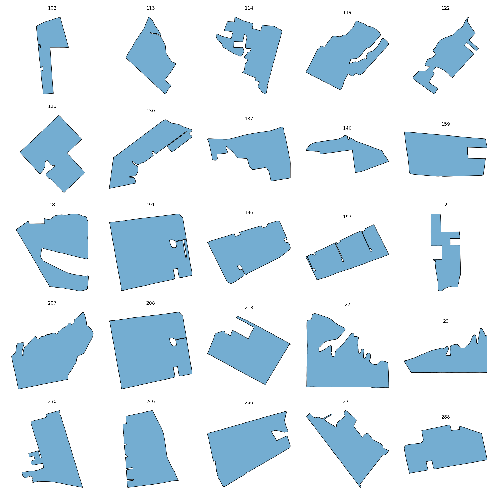

# ClassHighlyIrregular

This folder contains **53 fields** assigned to the **ClassHighlyIrregular** class.

## Gallery

## Statistics

| Metric | Value |
|----------|----------|
| Fields | 53 |
| Mean Area | 966704.86 |
| Mean Perimeter | 5243.23 |
| Mean Convexity | 0.798 |
| Mean Elongation | 1.656 |
| Mean Rectangularity | 0.697 |
| Mean Boundary Complexity | 42.893 |

## Contents

- JSON field descriptions
- Individual field renderings in `images/`
- Class gallery
