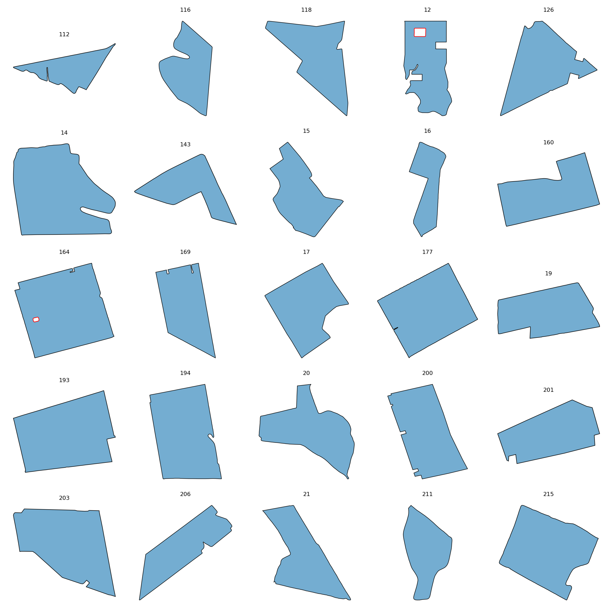

# ClassIrregular

This folder contains **69 fields** assigned to the **ClassIrregular** class.

## Gallery

## Statistics

| Metric | Value |
|----------|----------|
| Fields | 69 |
| Mean Area | 1001569.58 |
| Mean Perimeter | 4558.12 |
| Mean Convexity | 0.924 |
| Mean Elongation | 1.758 |
| Mean Rectangularity | 0.714 |
| Mean Boundary Complexity | 8.277 |

## Contents

- JSON field descriptions
- Individual field renderings in `images/`
- Class gallery
