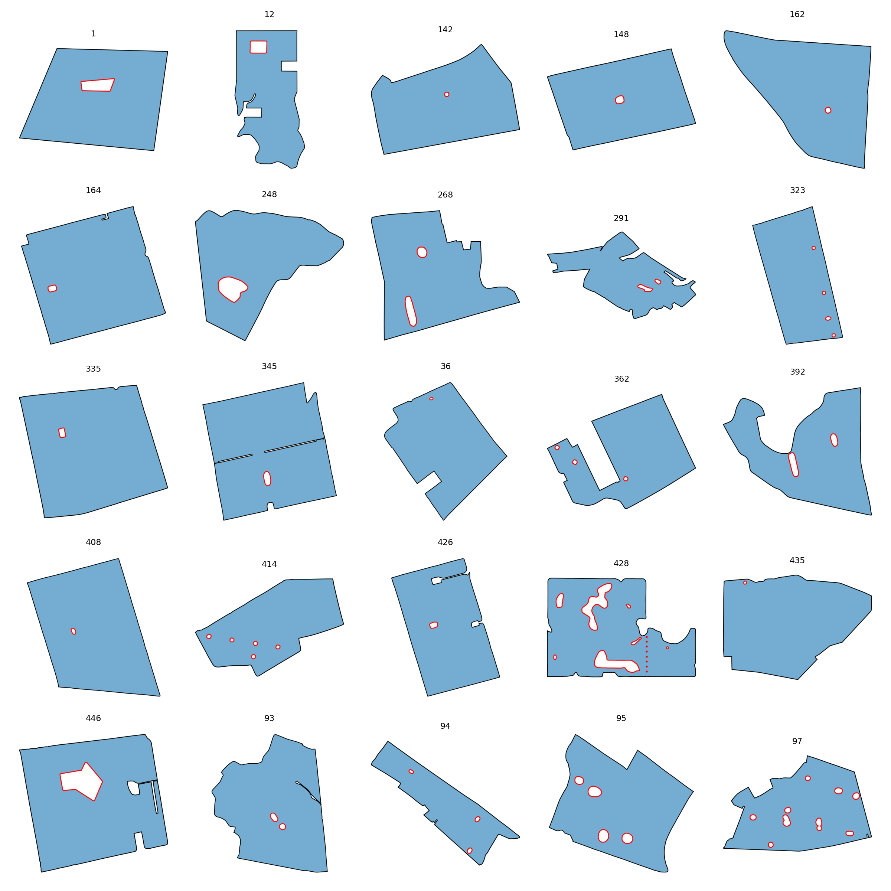

# ClassObstacles

This folder contains **26 fields** assigned to the **ClassObstacles** class.

## Gallery

## Statistics

| Metric | Value |
|----------|----------|
| Fields | 26 |
| Mean Area | 1172988.39 |
| Mean Perimeter | 4888.80 |
| Mean Convexity | 0.922 |
| Mean Elongation | 1.542 |
| Mean Rectangularity | 0.799 |
| Mean Boundary Complexity | 63.082 |

## Contents

- JSON field descriptions
- Individual field renderings in `images/`
- Class gallery
