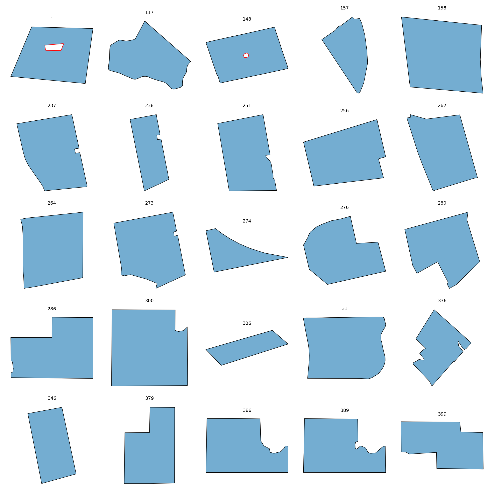

# ClassSmooth

This folder contains **46 fields** assigned to the **ClassSmooth** class.

## Gallery

## Statistics

| Metric | Value |
|----------|----------|
| Fields | 46 |
| Mean Area | 1600821.42 |
| Mean Perimeter | 4759.74 |
| Mean Convexity | 0.964 |
| Mean Elongation | 1.750 |
| Mean Rectangularity | 0.808 |
| Mean Boundary Complexity | 0.427 |

## Contents

- JSON field descriptions
- Individual field renderings in `images/`
- Class gallery
